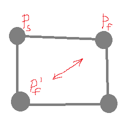

# 检测链表有环中的数学
> 面试官：如何判断一个链表中有环？

答：使用快慢指针，慢指针步长为1，快指针步长为2，若相遇，则链表有环

> 步长可以为3吗？

答：这...

## 链表环与模N运算
那么，现在考虑步长为2和1的情况，看看与模N运算的关系。假设链表环长为4，初始位置为-1（离环入口1）

步长/第k次|0(初始位置)|1|2|3|4|5|...
:-:|:-:|:-:|:-:|:-:|:-:|:-:|:-:
1|3|0|1|2|**3**|0|...
2|3|1|3|1|**3**|1|...

画图也可知，必定在第一圈，并且在第四步快慢指针相遇。

其实，快慢指针相遇的问题可以抽象为同余问题。

## 快指针为啥步长为2？
### 相对速度法
此时两者相对速度为1。某一时刻，两者都在环上，则快指针每步相对运动移动了1个节点，将遍历所有环路节点直至与慢指针相遇。

### 步长为3会出现什么情况呢？
假设环路节点数目为4，Pf表示快指针，Ps表示慢指针。则Pf每次以相对速度2移动，只能在Pf与Pf'两个位置，无法与Ps相遇。

*数学解释便是，由于gcd(step, N) = gcd(2, 4) != 1，因此无法产生一个完整的剩余类集合*

*ps.多亏我舍友用四个手指比划来比划去，举出这个形象的例子*
### 论证步长为2
假设环路长N，慢指针在环路某一节点Xk，步长r1，快指针在环路某一节点Xs，步长r2，那么t时间后，慢指针所在位置为，

modN=(Xk+t)modN)

快指针所在位置为，

modN)

两者相遇的条件为,

即，

modN=(Xs+r_2t)modN)

即，

tmodN)

题目变为：**当`r_2`满足什么条件时，方程有解**，这便是[线性同余问题](https://baike.baidu.com/item/%E7%BA%BF%E6%80%A7%E5%90%8C%E4%BD%99%E6%96%B9%E7%A8%8B/5544515?fr=aladdin)。

即，对于形如ax≡b (mod n)的方程。此方程有解当且仅当 b 能够被 a 与 n 的最大公约数整除（记作 `gcd(a,n) | b`）。

则，方程有解当且仅当 `r_2` 满足：

|(Xk-Xs))

而当 `r_2=2` 时，上面条件恒成立，方程恒有解。
